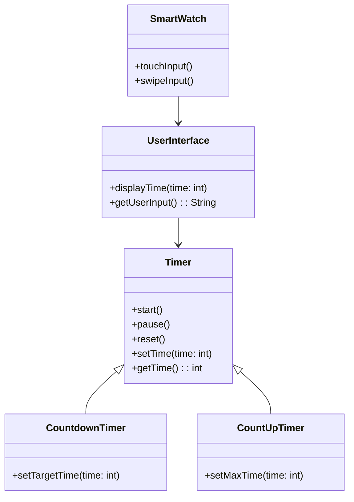

```mermaid
classDiagram
    class Timer {
        +start()
        +pause()
        +reset()
        +setTime(time: int)
        +getTime(): int
    }

    class CountdownTimer {
        +setTargetTime(time: int)
    }

    class CountUpTimer {
        +setMaxTime(time: int)
    }

    class UserInterface {
        +displayTime(time: int)
        +getUserInput(): String
    }

    class SmartWatch {
        +touchInput()
        +swipeInput()
    }

    Timer <|-- CountdownTimer
    Timer <|-- CountUpTimer
    UserInterface --> Timer
    SmartWatch --> UserInterface
```
