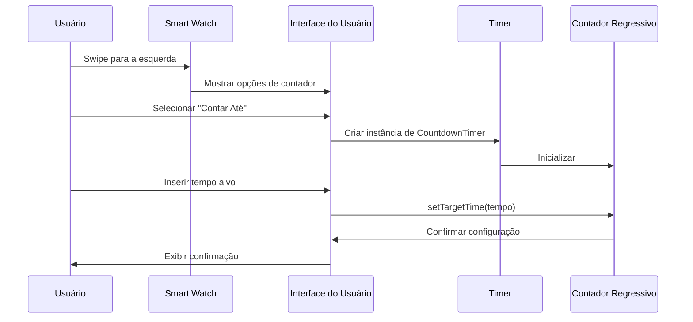

```mermaid
sequenceDiagram
    participant User as Usuário
    participant SmartWatch as Smart Watch
    participant UserInterface as Interface do Usuário
    participant Timer as Timer
    participant CountdownTimer as Contador Regressivo

    User ->> SmartWatch: Swipe para a esquerda
    SmartWatch ->> UserInterface: Mostrar opções de contador
    User ->> UserInterface: Selecionar "Contar Até"
    UserInterface ->> Timer: Criar instância de CountdownTimer
    Timer ->> CountdownTimer: Inicializar
    User ->> UserInterface: Inserir tempo alvo
    UserInterface ->> CountdownTimer: setTargetTime(tempo)
    CountdownTimer ->> UserInterface: Confirmar configuração
    UserInterface ->> User: Exibir confirmação
```
